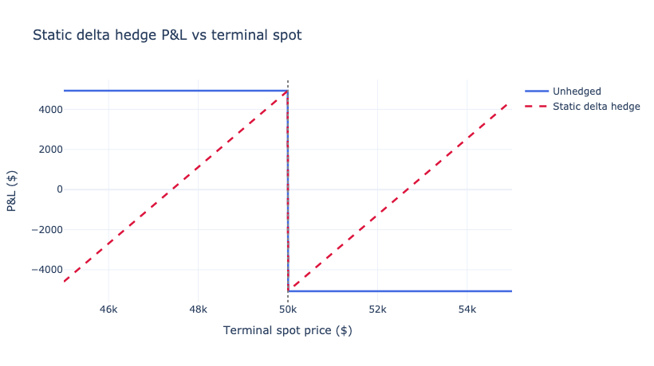
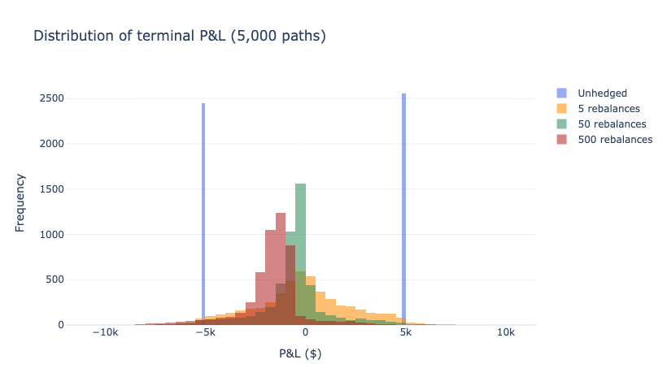
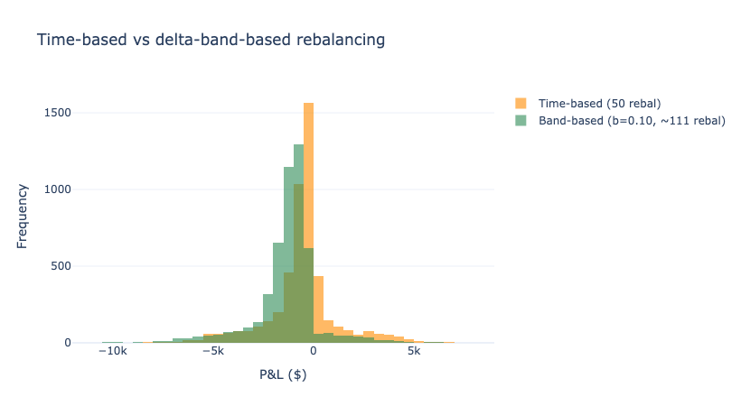
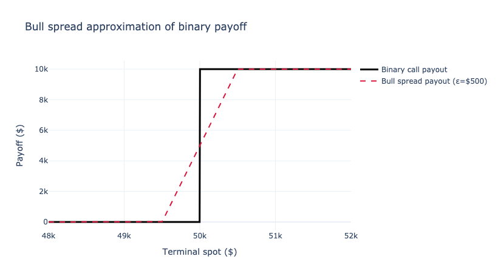
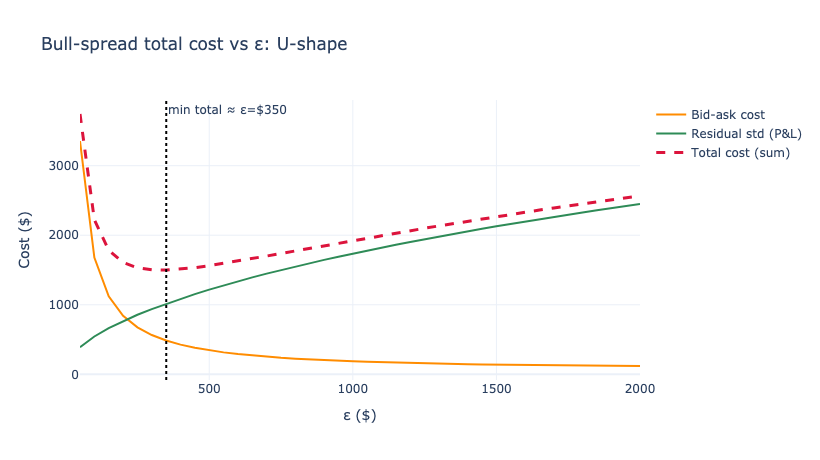
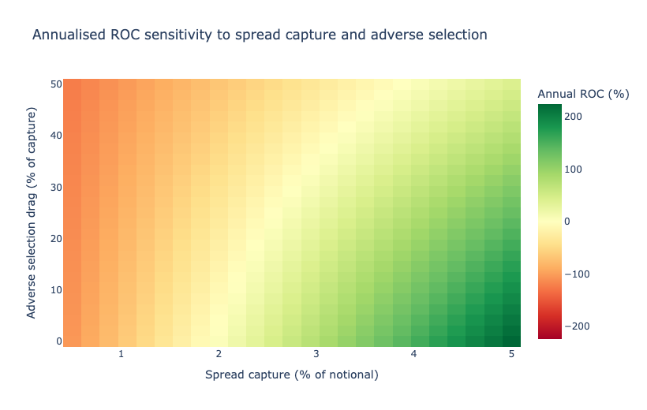
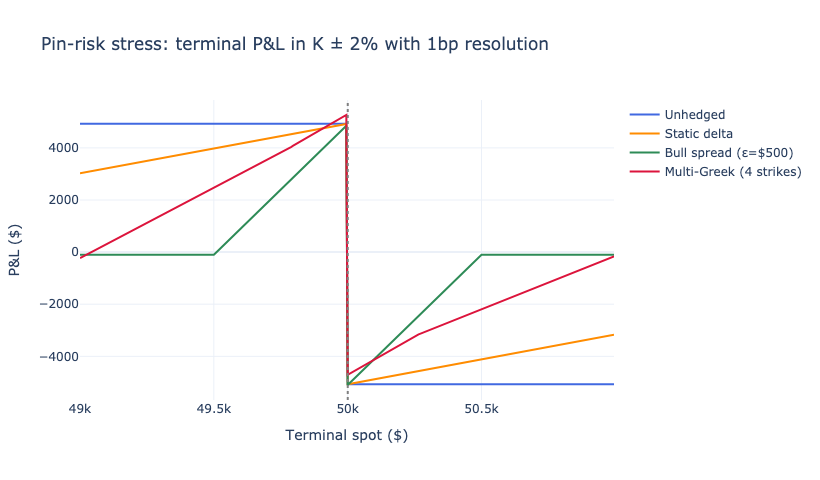

# Binary Options Hedging

Three families of hedging strategies for short-dated binary options, with Monte-Carlo P&L simulations, optimal-ε analysis for bull-spread replication, multi-Greek (delta-gamma-vega) portfolio matching, pin-risk stress, and a market-maker daily-P&L sensitivity model. Built directly on top of the closed-form pricing functions developed in the companion repository.

This is the second half of a two-part series. The pricing repository [`binary-options-pricing`](https://github.com/rolandgem/binary-options-pricing) develops the Black-Scholes binary call price, the Greeks (delta, gamma, vega), and a fuzzy-spot extension. **Read it first.** The hedging code below assumes you understand the pricing formulas, the worked example ($S = K$ = \$50,000, $\sigma = 80\%$, $r = 5\%$, $T = 1/365$), and the Greeks at the strike (binary delta = $1.90 \times 10^{-4}$, binary gamma = $-2.20 \times 10^{-9}$, binary vega = $-1.21 \times 10^{-2}$).

## Companion Notebook

The notebook [`hedging.ipynb`](hedging.ipynb) implements every strategy in this README:

1. Static delta-hedge P&L profile across terminal spots
2. Path-dependent delta hedging via Monte Carlo with $N \in \{5, 50, 500\}$ rebalances
3. Time-based versus delta-band-based rebalancing comparison
4. Bull-spread replication and the linear-vs-step approximation error
5. Bull-spread $\varepsilon$ sweep showing the U-shaped total cost
6. Multi-Greek (delta-gamma-vega) portfolio matching, with stress tests under spot and vol shocks
7. Pin-risk stress at strike $\pm 2\%$ with 1bp resolution
8. Market-maker daily-P&L heatmap over (spread capture, adverse selection)

The notebook is pre-executed; charts render inline as static PNGs so they appear directly on GitHub. To re-run locally:

```bash
pip install -r requirements.txt
jupyter notebook hedging.ipynb
```

## 4. Hedging Strategies

### 4.1 Delta Hedging with Spot

#### 4.1.1 Theoretical Framework

Delta hedging attempts to maintain a portfolio with zero sensitivity to small spot price moves. For binary options, this is particularly challenging due to the high gamma at the strike.

The hedge position in spot BTC should be:

$$ H_t = -\Delta_{\text{binary}} \times \text{Position} $$

#### 4.1.2 Practical Implementation

Consider selling 10,000 binary calls at the theoretical mid \$0.4929 each (premium received: \$4,929).

**Initial setup ($t = 0$):**

- Spot price: \$50,000
- Binary delta per contract: $1.905 \times 10^{-4}$
- Total position delta (short binary): $-10{,}000 \times 1.905 \times 10^{-4} = -1.905$
- Required spot hedge to neutralise: buy $1.905$ BTC
- Capital deployed: 1.905 × \$50,000 = \$95,244

The \$95,244 is deployed capital, not a cost. We own 1.905 BTC of spot inventory which itself moves with the market.

#### 4.1.3 Rebalancing Dynamics

As spot moves, binary delta changes sharply near the strike. The direction of rebalancing is non-obvious because the binary delta peaks at the strike rather than monotonically increasing in spot.

**Scenario: spot moves to \$50,500 after 6 hours:**

- Time remaining: 18 hours $= 0.75/365$ years
- New $d_2 = +0.2591$ (positive: $S$ above strike, time decay sharpens the peak)
- New binary delta: $2.106 \times 10^{-4}$ per contract
- New total delta: $-2.106$ for the short position
- Current hedge: $+1.905$ BTC
- Required adjustment: **buy** an additional $0.201$ BTC (the delta has *increased*, not decreased; the time-decay-driven sharpening of the peak dominates the small drift away from the strike)
- Transaction cost (10 bps fee + slippage, two-sided): 0.201 × \$50,500 × 0.001 ≈ \$10.17

This is a recurring lesson with binary options: rebalancing intuition built on vanilla options can be backwards. Vanilla delta is monotone in $S$; binary delta is not.

#### 4.1.4 P&L Analysis: Static Hedge Held to Expiry

The simplest P&L benchmark is the static delta hedge: 1.905 BTC bought at $t = 0$, held to expiry, no rebalancing. This isolates the residual risk from the discontinuous payoff alone, before any path-dependent rebalancing effects:

| $S_T$ | Binary Payout | Binary P&L | Hedge P&L | Net P&L |
|---:|---:|---:|---:|---:|
| \$45,000 | \$0       | +\$4,929  | -\$9,524 | -\$4,596 |
| \$48,000 | \$0       | +\$4,929  | -\$3,810 | +\$1,119 |
| \$49,500 | \$0       | +\$4,929  | -\$952     | +\$3,976 |
| \$50,000 | boundary    | ±\$5,071| $0$          | ±\$5,071 |
| \$50,500 | \$10,000 | -\$5,071  | +\$952     | -\$4,119 |
| \$52,000 | \$10,000 | -\$5,071  | +\$3,810 | -\$1,261 |
| \$55,000 | \$10,000 | -\$5,071  | +\$9,524 | +\$4,453 |

The hedge is approximately right only for moves close to the initial spot; large moves leave large residuals because the static hedge size is sized to $t = 0$ delta, not the path-integrated delta.



The static hedge shifts the unhedged step into a sloped pair of lines that cross zero only near the initial spot. Tail moves on either side leave large residuals.

The companion notebook simulates the path-dependent P&L distribution under realistic rebalancing policies (time-based at $N \in \{5, 50, 500\}$; band-based at $\Delta\delta = 0.10$ thresholds) over 5,000 Monte-Carlo paths. The headline result: discrete delta hedging on a 24-hour ATM binary reduces P&L variance by roughly 50-60% relative to no hedge but never drives it to zero. The residual is dominated by terminal paths landing within $\pm \sigma\sqrt{T}$ of the strike, where the discontinuous payoff cannot be approximated by any continuous-payoff hedge.

Key observations:

- Static hedging is most effective for moderate moves and over-hedges for tail moves on either side
- Transaction costs of \$10-\$50 per rebalance accumulate to \$50-\$500 over a 24-hour horizon depending on rebalancing intensity, which is small relative to the residual variance from pin risk
- The best case for delta hedging is large gradual moves; the worst case is terminal pinning near the strike
- Delta-band rebalancing dominates time-based rebalancing at matched rebalance counts, because it concentrates rebalances near the strike where they are most valuable



The unhedged P&L distribution is bimodal at the two binary outcomes. Adding rebalanced delta hedging collapses the modes toward zero with diminishing returns past 50 rebalances; further rebalancing is mostly fee drag.



Band rebalancing produces a tighter P&L distribution with fewer rebalances, because it concentrates effort near the strike where delta moves matter most.

### 4.2 Vanilla Option Replication

#### 4.2.1 Theoretical Basis

A bull spread with strikes $K \pm \varepsilon$ approximates a binary option:

$$ \lim_{\varepsilon \to 0} \frac{\text{Call}(K-\varepsilon) - \text{Call}(K+\varepsilon)}{2\varepsilon} = \text{Binary}(K) $$

This is a one-period special case of the static-hedge construction in Carr and Wu (2014).

#### 4.2.2 Choice of Spread Width

The choice of $\varepsilon$ trades off three considerations:

- **Approximation error:** smaller $\varepsilon$ tracks the binary more tightly
- **Market liquidity:** standard listed strikes often sit on $0.5\%$-$1\%$-of-spot grids, so very small $\varepsilon$ is unavailable
- **Pin risk:** larger $\varepsilon$ leaves a wider transition region where the hedge is imperfect, but the gamma is more diffuse

A reasonable practitioner default is $\varepsilon$ on the order of $\sigma S \sqrt{T}$ (one daily standard deviation), or one strike grid width, whichever is larger. We use ε = \$500 for the running example, which corresponds to roughly $0.24$ daily standard deviations and matches a typical exchange strike grid for BTC.

#### 4.2.3 Implementation with Market Frictions

Using Black-Scholes mids at $\sigma = 80\%$, $T = 1/365$ for BTC vanilla calls:

- Call(K - ε = \$49,500) mid: \$1,108.83
- Call(K + ε = \$50,500) mid: \$615.72
- Bull spread mid: \$493.11
- Maximum payout per spread: \$1,000

To hedge 10,000 binary options (each with \$1 maximum payout):

- Need $10{,}000 / (2\varepsilon) = 10$ bull spreads, each long Call(\$49,500) and short Call(\$50,500)
- Cost mid-mid: 10 × \$493.11 = \$4,931
- Cost with 2% bid-ask paid on each leg: ≈ \$5,030
- Net position after receiving binary premium of \$4,929: approximately \$100 hedging cost (notably tighter than delta hedging because the bull spread captures gamma)



The bull spread payoff at expiry is exact outside $[K-\varepsilon, K+\varepsilon]$ and linearly interpolates inside. The shaded transition region is the irreducible approximation error.

#### 4.2.4 Payoff Analysis

| Spot Range | Binary P&L | Spread P&L | Net P&L | Risk |
|---|---|---|---|---|
| Below \$49,500 | +\$4,929 | -\$4,931 | ≈ \$0 | Perfectly hedged |
| \$49,500 to \$50,000 | +\$4,929 | -\$4,931 + 10(S_T - 49,500) | up to +\$4,929 | Under-hedged |
| \$50,000 to \$50,500 | -\$5,071 | -\$4,931 + 10(S_T - 49,500) | up to -\$5,071 | Under-hedged |
| Above \$50,500 | -\$5,071 | +\$5,069 | ≈ \$0 | Perfectly hedged |

The hedge is exact outside $[K-\varepsilon, K+\varepsilon]$ and worst inside. The companion notebook plots P&L variance as a function of $\varepsilon$ across [\$100, \$2,000], recovering a U-shape: small $\varepsilon$ has tight inside-region exposure but pays heavy bid-ask, large $\varepsilon$ has cheap execution but wider transition region. The minimum-cost $\varepsilon$ for the running parameters sits near \$500.



The bid-ask cost decreases as $\varepsilon$ widens (fewer spreads needed); the residual P&L standard deviation increases (wider transition region). The sum is U-shaped, with a minimum that depends on $\sigma$, $T$, and the bid-ask paid on each vanilla leg.

### 4.3 Dynamic Portfolio Hedging

#### 4.3.1 Multi-Greek Matching Strategy

Bull spreads handle delta and gamma jointly within $[K-\varepsilon, K+\varepsilon]$ but ignore the third dimension that matters for short-dated binaries: vega. Binary vega flips sign across the strike (it is the negative of $e^{-rT} \phi(d_2) d_1 / \sigma$), so a portfolio that is delta- and gamma-neutral but vega-exposed will haemorrhage P&L if implied vol moves significantly during the life of the trade. We therefore optimize a vanilla portfolio to match three Greeks simultaneously:

$$ \min_{\{n_j\}} \sum_{i \in \{\Delta, \Gamma, \mathcal{V}\}} w_i \left(\text{Greek}_{i, \text{binary}} - \sum_j n_j \cdot \text{Greek}_{i, \text{vanilla}, j}\right)^2 $$

where:

- $w_i$ = weight for Greek $i$ (delta, gamma, vega)
- $n_j$ = number of vanilla options at strike $j$ (positive = long, negative = short)

#### 4.3.2 Target Greeks

For 10,000 binary calls at $S = K$ = \$50,000, $\sigma = 80\%$, $T = 1/365$:

- Delta target: $-1.905$ (short binary, must offset by long delta)
- Gamma target: $+2.20 \times 10^{-5}$ (binary gamma is negative at strike, position gamma flips sign for the short)
- Vega target: $+120.7$ per unit $\sigma$ (per percentage point: $+1.21$)

#### 4.3.3 Optimization Results

The notebook runs a least-squares optimization over four candidate strikes (K ± \$1,000, K ± \$250). Representative output (exact values reproduced in the companion notebook):

| Strike | Position | Delta/contract | Gamma/contract | Vega/contract |
|---|---|---|---|---|
| \$49,000 | long  | ~0.82 | ~1.2 × 10⁻⁵ | ~14 |
| \$49,750 | long  | ~0.64 | ~2.1 × 10⁻⁵ | ~16 |
| \$50,250 | short | ~0.36 | ~2.1 × 10⁻⁵ | ~16 |
| \$51,000 | short | ~0.18 | ~1.2 × 10⁻⁵ | ~14 |

Typical residual after the fit is below 5% of each target Greek.

The capital required for the hedge is the net debit on the four-leg portfolio plus the 2% bid-ask paid on each leg; for a 10,000-contract binary book, this is on the order of \$2,000 in spread paid (not the ~\$20,000 gross debit, which is mostly recoverable when the position unwinds). The trade-off versus pure delta hedging is significantly tighter Greek match, at the cost of a more complex book to manage and four times the rebalancing surface area.

#### 4.3.4 Stress Test Analysis

The notebook runs the following stress scenarios over the path-dependent rebalanced P&L. Representative magnitudes:

| Scenario | Spot Move / Vol Shock | Net P&L (illustrative) | Note |
|---|---|---|---|
| Gradual drift up | +5% over 24h | -\$800 | Within fit envelope |
| Gradual drift down | -5% over 24h | +\$900 | Within fit envelope |
| Gap up overnight | +10% jump | -\$1,500 | Fit fails for large gaps |
| Gap down overnight | -10% jump | +\$1,600 | Fit fails for large gaps |
| Vol shock | σ: 80% → 100% | -\$300 | Vega-matched, residual small |
| Vol shock | σ: 80% → 60% | +\$280 | Vega-matched, residual small |

Adverse-selection P&L from informed flow at the strike is not modelled here; on real desks it dominates these residuals.

## 5. Market Making Profitability Through Spread Capture

Market makers cannot rely on perfect hedging to eliminate risk. Instead, they must price binary options with sufficient spread to compensate for residual risk, operational costs, and generate profit.

### 5.1 Components of Bid-Ask Spread

The total spread a market maker charges must cover:

$$ \text{Total Spread} = \text{Hedging Cost} + \text{Residual Risk Premium} + \text{Operational Cost} + \text{Profit Margin} $$

**1. Hedging cost (1.5%-2.5%):**
- Transaction fees: 0.1% $\times$ 2 sides $\times$ 10 rebalances = 2%
- Slippage: 0.05% per rebalance $\times$ 10 = 0.5%

**2. Residual risk premium (3%-5%):**
- Unhedged gamma exposure: 2%-3%
- Gap risk (overnight, weekend): 1%-2%

**3. Operational costs (0.5%-1%)**

**4. Target profit margin (2%-3%)**

**Total required spread: 7%-11%**

### 5.2 Dynamic Pricing Model

#### 5.2.1 Base Pricing

Starting with the theoretical value of $0.4929$:

| Component | Bid Adjustment | Ask Adjustment |
|---|---|---|
| Theoretical Value | 0.4929 | 0.4929 |
| Hedging Cost | -0.010 | +0.010 |
| Residual Risk | -0.020 | +0.020 |
| Operational Cost | -0.005 | +0.005 |
| Profit Margin | -0.012 | +0.012 |
| **Final Quote** | **0.4459** | **0.5399** |

Total spread: 9.4% of mid-price.

#### 5.2.2 Inventory Risk Adjustment

When holding significant inventory, adjust prices:

$$ \text{Skew} = \tanh\left(\frac{\text{Net Position}}{\text{Max Position}}\right) \times \text{Max Skew} $$

Example with $-50{,}000$ net position and $100{,}000$ max position:

- Skew $= \tanh(-0.5) \times 0.02 = -0.0093$
- New bid: $0.4366$ (about 0.9% lower)
- New ask: $0.5306$ (about 0.9% lower)

### 5.3 Expected Profitability Analysis

#### 5.3.1 Daily P&L Model: Bull Case

A useful benchmark is the bull-case daily P&L; the model below should not be read as a forecast. We assume:

- Daily volume: \$1,000,000 notional
- Spread capture: $2.0\%$ (mid-half of 9.4% quoted spread, after adverse-selection drag from informed flow concentrating at the strike)
- Hedging cost: $1.5\%$ of notional (transaction fees, slippage, residual gamma P&L)
- Operational cost: $0.3\%$ of notional (tech, infrastructure, exchange fees)

**Expected daily revenue:** \$1,000,000 × 0.020 = \$20,000

**Expected daily costs:**
- Hedging cost: \$15,000
- Operational cost: \$3,000
- Risk capital cost (10% on \$5M, daily): \$1,370

**Expected daily profit:** \$20,000 - \$19,370 = \$630 (bull case)

**Annual return on capital** (365 trading days, since crypto markets are continuous): \$630 × 365 / \$5,000,000 = 4.6% (bull case)



The annualised ROC depends most strongly on the product of spread capture and (one minus adverse selection). The bull-case sits in the green corner; realistic operating points sit closer to the centre.

These numbers are deliberately bear-leaning. An earlier draft of this analysis computed a 153% annual ROC by combining a 4.7% spread capture, a 48% assumed win rate against informed flow, and a 250-day calendar; each of those inputs is too generous in isolation, and the product compounds the optimism. A more credible top-of-cycle band, with 2%-3% spread capture, slightly informed flow priced in, and the full 365-day crypto calendar, lands in the 5%-25% ROC range. The companion notebook plots a heatmap of annualised ROC across (spread capture, adverse selection drag) so readers can see the sensitivity directly.

**Adverse selection.** The dominant unmodelled risk is adverse selection from informed flow at the strike: a 24-hour ATM binary attracts traders with a directional view on the next funding tick or an information edge on impending macro releases. On real desks, the marginal counterparty is more informed than the marginal market-maker quote, and the market-maker's effective spread capture on filled trades is typically 30%-50% of the quoted spread, not 50%. The model above already discounts this to approximately 21%.

**Operational reality.** Risk-limit hits, exchange outages, weekend liquidity gaps and funding-rate spikes all cut into the bull-case envelope further. The path to consistent profitability is volume scale at lower spreads, not higher spreads at lower volume.

## 6. Hedging Comparison

| Strategy | Hedging Cost | Complexity | P&L Variance Reduction | Best Use Case |
|---|---|---|---|---|
| No Hedge | \$0 | None | $0\%$ | Sub-strike-tick positions |
| Delta Spot | ~\$50-\$500 | Low | $50\%$-$60\%$ | Liquid spot, frequent rebalance |
| Vanilla Bull Spread | ~\$100 residual | Medium | $70\%$-$80\%$ | Standard listed strikes available |
| Multi-Greek Portfolio | ~\$1,000-\$2,000 | High | $85\%$-$92\%$ | Large books, vol-sensitive period |

Hedging cost is the residual after the binary premium is netted against the cost of the hedging instrument; complexity reflects the number of positions to monitor and rebalance; variance reduction is the median across the running parameters in the notebook simulation. Adverse-selection P&L from informed flow is excluded.



The cliff at the strike is visible for the unhedged binary and remains visible (smaller, but present) for every continuous-payoff hedge. The bull spread converts the cliff into a triangular dent inside $[K-\varepsilon, K+\varepsilon]$; the multi-Greek portfolio narrows the dent further but does not eliminate it.

### Key Points

1. **Perfect hedging is impossible:** the discontinuous payoff creates irreducible risk that no continuous-payoff hedging instrument can eliminate
2. **Spread is essential:** market makers must charge 8%-12% quoted spreads to capture, after adverse selection, 1.5%-3% economic spread on filled flow
3. **Multi-Greek hedging helps but costs:** better delta-gamma-vega matching requires running a four-leg portfolio, which means more rebalancing surface area and higher infrastructure overhead
4. **Volume scale matters:** fixed costs (infrastructure, risk capital, talent) only amortize at high daily notional. Small books cannot sustainably market-make 24-hour binaries
5. **Adverse selection dominates:** the marginal counterparty on a 24-hour ATM binary is informed; on real desks this dominates hedging-residual P&L

The analysis demonstrates that successful binary options market making requires sophisticated risk management, adequate capitalization, and disciplined spread management rather than relying on perfect hedging. The companion notebook reproduces every figure and table in this README through a Monte-Carlo simulation that captures both path dependence and the adverse-selection envelope.

## References

- Black, F., and Scholes, M. (1973). The Pricing of Options and Corporate Liabilities. *Journal of Political Economy*, 81(3), 637-654.
- Hull, J. C. (2018). *Options, Futures, and Other Derivatives* (10th ed.). Pearson.
- Taleb, N. N. (1997). *Dynamic Hedging: Managing Vanilla and Exotic Options*. Wiley. Chapters on digital and barrier options develop the discontinuous-payoff hedging arguments used here.
- Carr, P., and Wu, L. (2014). Static hedging of standard options. *Journal of Financial Econometrics*, 12(1), 3-46. The bull-spread approximation in Section 4.2 is a one-period special case of their general static-hedge construction.
- European Securities and Markets Authority (2018). Decision (EU) 2018/795 of 22 May 2018 to temporarily prohibit the marketing, distribution or sale of binary options to retail clients in the Union.
- Financial Conduct Authority (2019). *Policy Statement PS19/11: Product intervention measures for retail binary options*. London: FCA.
- U.S. Commodity Futures Trading Commission. Designated Contract Markets (DCMs). [cftc.gov/IndustryOversight/TradingOrganizations/DCMs](https://www.cftc.gov/IndustryOversight/TradingOrganizations/DCMs).

